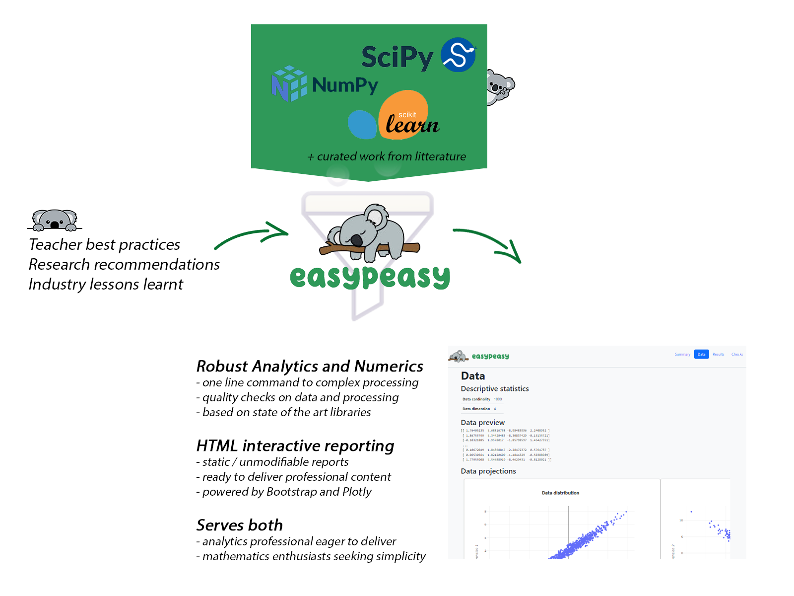

# Let’s discover easypeasy !
easypeasy is a Python package that mixes **robust Python libraries in data science** and **academic/industrial lessons learnt** - publicly disseminated - in application of these methods. The result is one line command toward each of your favorite scipy/numpy/scikit-learns/pandas routines, and a **full featured HTML** reports bringing all needed **interactivity** along your analysis tasks and data.

*Figure 1 - easypeasy combines both state of the art libraries and professionals best practices*
## Easypeasy key features for professional data scientists
- Easypeasy produces at no cost **professional looking & standalone reports**. You can share results, and **deliver** them without taking care of your **customer** environment. Sharing one standalone HTML file in a mail is all it requires.
- Easypeasy implements **by default all robustness and quality checks** known to date along each of the analysis you want to implement. Matrix conditioning, convergence, stability of results, ... : all these naughty details you learnt at school are not forgotten, and **augmented along state of the art evolution**
- Easypeasy **can not output a numerical results which is dubious.** If dubious, it is highlighted in big bold red letters in the report, or escalated via Python Exception mechanism.
- Easypeasy is free, and does not reinvent the wheel
## Easypeasy key features for professional engineers and data scientist enthusiasts
You did that **MOOC** everybody advised you to do, and you feel empowered by the all the new methods and techniques you learnt in data science domain. **Hold on, hold on** and read the next. Most of the techniques you learnt assumes some characteristics of your data to be valid. **For example do you**:
- check gaussian distribution of your residuals after curve fitting ?
- check matrix conditioning before principal component analysis execution ?
- check for clusters in your data before learning a surrogate model ? 
- check for matrix conditioning before solving a least square problem ? 

If you anwered yes to all question: [look at previous section](#Easypeasy-key-features-for-professional-data-scientists). 
If you answered no to one of these question, Easypeasy will embed all required checks for all these methods you want to use, but **you are not expert about**. This is the path to generate the valid results you want to obtain. And because all of this is explained in HTML reports, **you'll improve your skills too** !
## I don't need easypeasy, I already have that fancy Jupyter notebook that embed all the check I need.
**This is exactly what you should do**. Easypeasy is the solution for those not having capitalized already this knowledge into reusable material (like Jupyter notebook), for those unsatisfied with this capitalization (not maintained, not complete, modifiable by others), or those not able to parse the litterature regularly to improve this material. If you have existing notebooks and processes to maitain, improve and disseminate this, easypeasy is not for you. **But please contact us at ...** so that we share lessons learnt and possibly incoporate your recipes into easypeasy !

# Why easypeasy
Easypeasy is the result of **10+ years** of thinking and observation of the Python language for scientific & analytics purposes. **As early adopters and ambassadors of the Python language in the European aerospace industry**, we watched how Python packages started to look like good old Fortran, and soon became as heavy as Java.

When we justified to our end users the choice to migrate from Java to Python, we highlighted the fact that each Java library included its own specific data format. **We don't want to waste time and effort converting from one data format to another** from one library to another.

**That was too complex: One package for Excel parsing ? One data format. One package for matrix inversion ? One data format.  One package for visualization ? One data format.** And at the end, that same 10x10 double array being converted against its will ... But it less and less true that Python still offers that simplicity. So ... you will be able now to execute complex scientific routines **without having to learn specific API you don't care about**. You know how to put your data in some array ? Great, that's all it takes !

And because **simplicity opens up science to as many people as possible**, we take particular care to qualify the numerical results you will get. It is not because a function returns a result that this result can be used to suppot a decision. **We use the exception mechanism so that a dubious numerical result shocks you as much as a syntax error.**

# Top features of easypeasy
Easypeasy is devoted to deliver you state of the art methods and latest research algorithms curated for engineering purposes. We'll maintain here a list of top features and link to demonstrative examples. And we'll start along:
- **sequencer**: an impressive research work that proposes to sort your data and find the underneath structure in it

# Top 3 spec of easypeasy
1. Any feature must expose a one line command that returns the result.
2. Any feature requiring data as an input must accept a Python list to feed that data.
3. Any usage limitation or domain restriction on a result must be escalated through Exception mechanism.

# This Python project implements circleci CI/CD !
Latest status:  

# Maintenance tasks
Here is a list of maintenance tasks to execute on this package. Most of these tasks depends on some external event, such as a third party accepting some pull request.

| Task Id | Task Description | Status |
| ----------- | ----------- | ----------- |
|1| When pull request https://github.com/dalya/Sequencer/pull/5 will be completed, remove `sequencer` directory from `third _parties`, and define dependency to TheSequencer in the new version. Remove all dependencies specific to sequencer in this project dependencies.| Pending |
